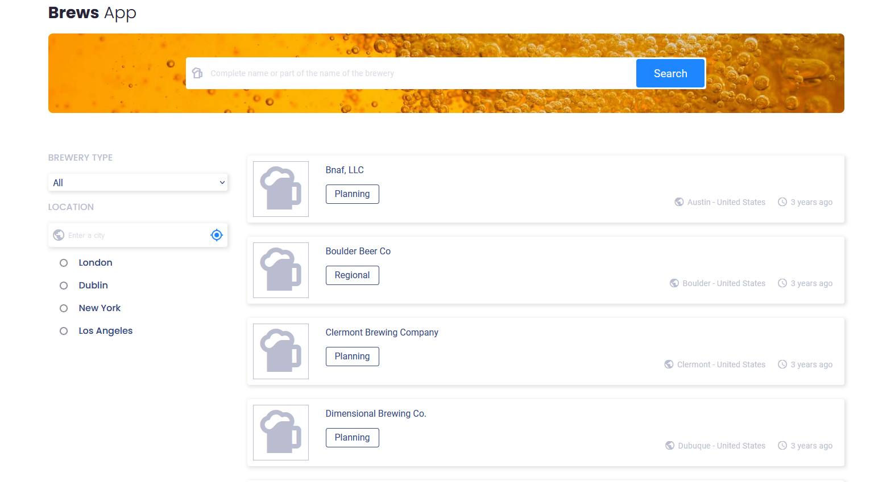

<!-- Please update value in the {}  -->

<h1 align="center">Brews app</h1>

<div align="center">
   Solution for a challenge from  <a href="http://devchallenges.io" target="_blank">Devchallenges.io</a>.
</div>

<div align="center">
  <h3>
    <a href="https://camain-elie.github.io/brews-app/">
      Demo
    </a>
    <span> | </span>
    <a href="https://github.com/camain-elie/brews-app">
      Solution
    </a>
    <span> | </span>
    <a href="https://devchallenges.io/challenges/TtUjDt19eIHxNQ4n5jps">
      Challenge
    </a>
  </h3>
</div>

<!-- TABLE OF CONTENTS -->

## Table of Contents

- [Overview](#overview)
  - [Built With](#built-with)
- [Features](#features)
- [How to use](#how-to-use)
- [Contact](#contact)
- [Acknowledgements](#acknowledgements)

<!-- OVERVIEW -->

## Overview



My solution to devchallenge.io's Github Jobs challenge.

Because the github job API is not listing any job and will soon be shut down, I decided to go for another API. I looked into Indeed, Monster and some other job services's APIs but all of them recquire some kind of permission or authentification to be used as a dev so I looked into another kind of API.

Finally, I settled for the Open Brewery DB API. It suits the need of this challenge, instead of jobs, you can look for a brewery and all of the user stories are still fulfilled !

The API has its limits, it contains mostly breweries from the US and the UK, so you won't find breweries from the rest of the world, sorry...

There are more than 7900 breweries listed by the API, in order to limit the number of pages of results, I limited the result list to only 50 results, which seems enough.

I learned a lot about React overall, about some javascript specificities and about API fetching ! I also got more comfortable with testing and file organization.

### Built With

<!-- This section should list any major frameworks that you built your project using. Here are a few examples.-->

- [React](https://reactjs.org/)
- [Create-React-App](https://create-react-app.dev/)
- [Sass](https://sass-lang.com/)

## Features

<!-- List the features of your application or follow the template. Don't share the figma file here :) -->

This application/site was created as a submission to a [DevChallenges](https://devchallenges.io/challenges) challenge. The [challenge](https://devchallenges.io/challenges/TtUjDt19eIHxNQ4n5jps) was to build an application to complete the given user stories.

User stories :
Note : As the API provide totally different data from the one provided by any job API, I adapted the user stories to the API I used, but the functionalities are still approximatively the same or sometimes even harder to develop.
- I can see a list of jobs in a city by default.
- ✔ I can search for jobs with a given keyword => with the complete or partial name of the brewery.
- ✔ I can search for jobs with a city name, zip code, or other location => only with a city, because the API is less flexible about the location requests than the github job API
- ✔ I can select one option from at least 4 pre-defined options.
- ✔ I can search for a full-time job only => I replace that by the type of the brewery.
- ✔ I can see a list of jobs with their logo, company name, location, and posted time. => the API did not provide any image, other than that, it is done. The posted time has been replaced by the last time the data has been updated.
- ✔ When I select a job, I can see job descriptions and how to apply like the given design. => a bit too specific for the breweries API but I replaced thae "how to apply" section by the contact details of the brewery.
- ✔ When I am on the job details page, I can go back to the search page.
- ✔ (optional) I can see a list of jobs in the closest city from my location by default => not by default but you can click on the position button to set your position !
- ✔ (optional) I can see jobs on different pages, 5 items on each page.

## How To Use

<!-- Example: -->

To clone and run this application, you'll need [Git](https://git-scm.com) and [Node.js](https://nodejs.org/en/download/) (which comes with [npm](http://npmjs.com)) installed on your computer. From your command line:

```bash
# Clone this repository
$ git clone https://github.com/camain-elie/brews-app

# Install dependencies
$ npm install

# Run the app
$ npm start
```

## Acknowledgements

<!-- This section should list any articles or add-ons/plugins that helps you to complete the project. This is optional but it will help you in the future. For example: -->

- [Stackoverflow - a few answers helped me a lot as usual](https://stackoverflow.com/)
- [React.js](https://fr.reactjs.org/)
- [Open Brewery DB](https://www.openbrewerydb.org/)

## Contact

- GitHub [@camain-elie](https://github.com/camain-elie)
